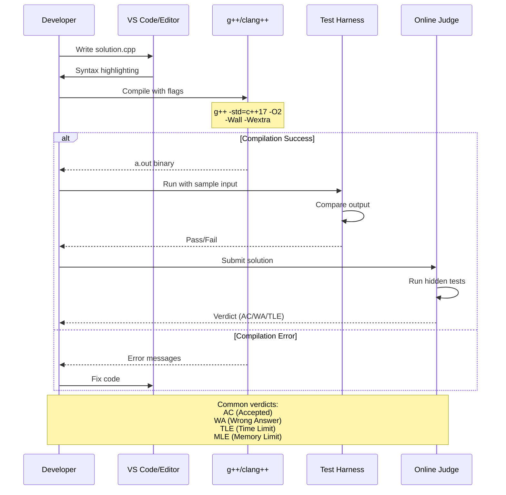
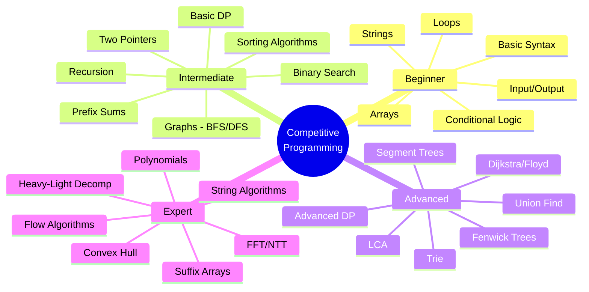
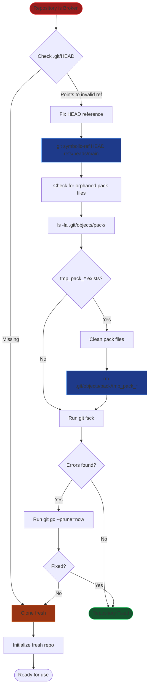

# Competitive Programming C++

C++ solutions for competitive programming problems.

## Architecture Diagrams

### 1. Repository Structure Flowchart

```mermaid
graph TD
    Root[Competitive_Programming_Cpp/]
    
    Root --> Platforms[Platforms/]
    Root --> Topics[Topics/]
    Root --> Templates[Templates/]
    Root --> Scripts[Scripts/]
    
    Platforms --> CF[Codeforces/]
    Platforms --> AC[AtCoder/]
    Platforms --> LC[LeetCode/]
    Platforms --> UVA[UVa/]
    Platforms --> SPOJ[SPOJ/]
    
    CF --> CFR1[Round 1/]
    CF --> CFR2[Round 2/]
    CF --> CFEdu[Educational/]
    
    Topics --> Graphs[Graphs/]
    Topics --> DP[Dynamic Programming/]
    Topics --> Strings[Strings/]
    Topics --> NT[Number Theory/]
    Topics --> DS[Data Structures/]
    Topics --> Greedy[Greedy/]
    
    Templates --> TemplateCPP[template.cpp]
    Templates --> HeaderH[common.h]
    Templates --> DebugH[debug.h]
    
    Scripts --> RunSh[run.sh]
    Scripts --> TestSh[test.sh]
    Scripts --> ParsePy[parse_problem.py]
    
    style Root fill:#2d5016,stroke:#4ade80,stroke-width:2px
    style Platforms fill:#1e3a8a,stroke:#60a5fa,stroke-width:2px
    style Topics fill:#9a3412,stroke:#fb923c,stroke-width:2px
    style Templates fill:#4c1d95,stroke:#a78bfa,stroke-width:2px
    style Scripts fill:#1e1e1e,stroke:#a1a1aa,stroke-width:2px
```



### 2. Git Workflow & Recovery Process

```mermaid
gitGraph
    commit id: "Initial (broken)"
    branch main
    checkout main
    
    commit id: "Fix HEAD"
    commit id: "Clean orphaned pack"
    
    branch develop
    checkout develop
    commit id: "Create folder structure"
    
    branch feature/template
    checkout feature/template
    commit id: "Add template.cpp"
    commit id: "Add debug macros"
    
    checkout develop
    merge feature/template id: "Merge template"
    
    checkout main
    merge develop id: "First stable version"
    
    branch feature/solution-1
    checkout feature/solution-1
    commit id: "Add A+B problem"
    commit id: "Add tests"
    
    checkout main
    merge feature/solution-1 id: "Merge solution"
    
    commit id: "Add .gitignore"
    commit id: "Add README"
    
    branch topic/graphs
    checkout topic/graphs
    commit id: "DFS implementation"
    commit id: "BFS implementation"
    commit id: "Dijkstra solution"
    
    checkout main
    merge topic/graphs id: "Graph module"
```

### 3. C++ Compilation & Testing Pipeline



### 4. Template.cpp Structure

```mermaid
classDiagram
    class Template {
        +Fast I/O Macros
        +Type Definitions
        +Debug Utilities
        +Math Helpers
        +Main Solution Function
    }
    
    class FastIO {
        +ios_base::sync_with_stdio()
        +cin.tie(NULL)
        +cout.tie(NULL)
        +'\n' instead of endl
    }
    
    class TypeDefs {
        +long long ll
        +unsigned long long ull
        +pair~int,int~ pii
        +vector~int~ vi
        +vector~ll~ vll
    }
    
    class Debug {
        +#ifdef LOCAL
        +cerr printing
        +dbg() macro
        +assert() statements
    }
    
    class Utilities {
        +gcd() / lcm()
        +powmod()
        +binary search helpers
        +string utilities
    }
    
    Template --> FastIO
    Template --> TypeDefs
    Template --> Debug
    Template --> Utilities
    
    MainFunction[main() function] --> Template
    MainFunction --> Solve[solve() function]
    
    style Template fill:#1a365d,stroke:#4299e1
    style FastIO fill:#22543d,stroke:#48bb78
    style Debug fill:#742a2a,stroke:#fc8181
```

### 5. Problem Categories & Difficulty Progression



### 6. Git Fix Process Step-by-Step



### 7. Algorithm Selection Decision Tree

```mermaid
graph TD
    Start[Read Problem] --> CheckN{N <= ?}
    
    CheckN -->|N <= 20| BFS[Meet-in-the-Middle<br/>Bitmask DP]
    CheckN -->|N <= 200| O3[O(n³) algorithms<br/>Floyd-Warshall]
    CheckN -->|N <= 2000| O2[O(n²) algorithms<br/>DP, BFS/DFS]
    CheckN -->|N <= 10^5| ON[O(n log n)<br/>Sorting, Segment Tree]
    CheckN -->|N <= 10^7| ONSqrt[O(n sqrt n)<br/>Sieve, Preprocessing]
    CheckN -->|N > 10^7| OLogN[O(log n) or O(1)<br/>Math formulas]
    
    CheckN --> CheckType{Problem Type?}
    
    CheckType -->|Graph| GraphChoice{Graph Type?}
    GraphChoice -->|Tree| Tree[DFS/BFS on tree<br/>LCA, DP on tree]
    GraphChoice -->|DAG| DAG[Topological sort<br/>DP on DAG]
    GraphChoice -->|Weighted| Weighted[Dijkstra<br/>Bellman-Ford]
    GraphChoice -->|Unweighted| BFS
    
    CheckType -->|DP| DPChoice{DP Type?}
    DPChoice -->|Knapsack| Knapsack[0/1 Knapsack<br/>Unbounded]
    DPChoice -->|Interval| Interval[MCM, Palindrome]
    DPChoice -->|Digit| Digit[Digit DP]
    
    CheckType -->|String| String[KMP, Z-function<br/>Suffix Array, Hash]
    
    style Start fill:#1e3a8a,stroke:#3b82f6
    style BFS fill:#854d0e,stroke:#eab308
    style O3 fill:#854d0e,stroke:#eab308
    style O2 fill:#854d0e,stroke:#eab308
    style ON fill:#166534,stroke:#22c55e
    style ONSqrt fill:#166534,stroke:#22c55e
    style OLogN fill:#991b1b,stroke:#ef4444
```
